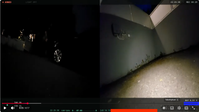
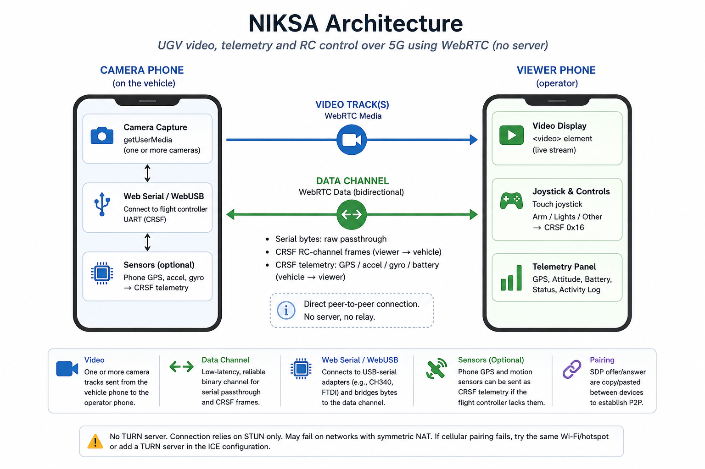
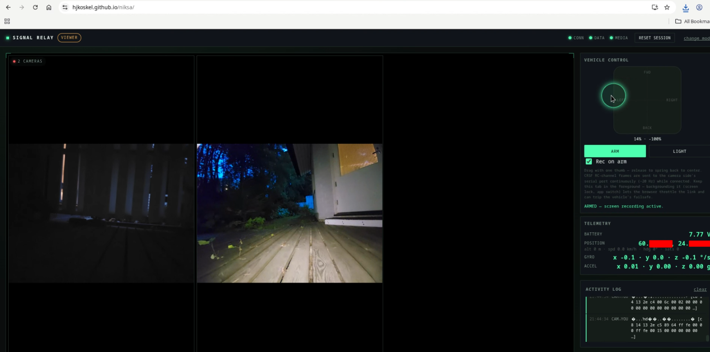
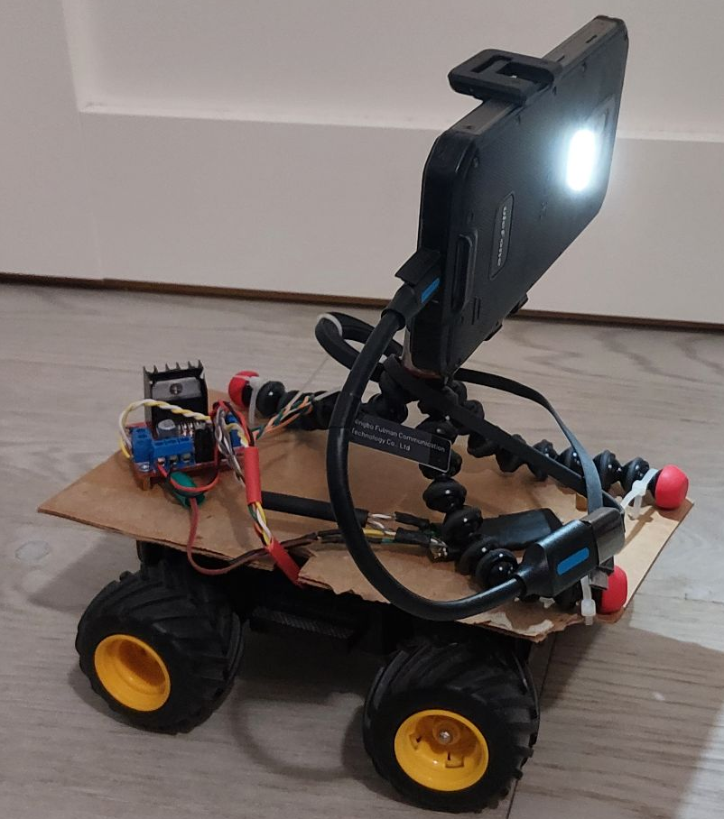

# NIKSA


**[Hosted on github pages https://hjkoskel.github.io/niksa/](https://hjkoskel.github.io/niksa/)**

(edit: correct video)
[](https://www.youtube.com/watch?v=DXlQ4oVlqAs "UGV test drive")


A proof of concept: **a UGV's video feed, telemetry, and RC control link, carried entirely over a phone's 5G connection and a browser tab — no radio transmitter, no video transmitter, no ground-station hardware, no server.**

Two phones (or a phone and a laptop), each running this page from a browser. One is bolted to the vehicle and plugged into its flight controller's UART. The other sits in the operator's hands. Everything in between — video, joystick control, GPS/IMU telemetry — rides over a single WebRTC connection negotiated peer-to-peer over the mobile network.

## The idea

Commercial FPV/UGV links (analog FPV, ELRS, TBS Crossfire, DJI O3) all solve the same three problems with dedicated radio hardware: get video from the vehicle to the operator, get stick input from the operator to the vehicle, and get telemetry back. This project asks how far you get solving the same three problems with hardware every phone already has — a camera, a modem, and (via Web Serial/WebUSB) a USB port — and nothing else.


## Slop warning

For me, this whole project has been a bit of a side quest from FPV drones. I also decided to write the code using a variety of AI tools, which made the project an interesting opportunity to experiment with AI-assisted development.

The main goal was to test 5G connectivity for remote-controlled vehicles. Crashing a toy car and dropping a phone from 10 cm is a lot more "money tolerable" than crashing a drone from 10 m when the USB connection fails during flight.

I'm also less worried about someone taking ideas from this project than I would be with my FPV projects. My guess is that Russians are more likely to just jam existing 5G connectivity than start building 5G-controlled vehicles and infrastructure out of Chinese hardware. So I'm not losing too much sleep over this one.

The code still has some issues, particularly with connection drops and the accumulation of log messages.

For testing, I only had an old, already-abused Nikko RC car platform. The brushed DC motors are now even more worn out, but the platform was still good enough to capture some material for my music video.

## Architecture




<!----
```
   CAMERA phone                                          VIEWER phone
┌─────────────────┐        WebRTC (P2P, no server)      ┌─────────────────┐
│  getUserMedia    │──── video track ──────────────────▶│  <video>         │
│  (one or more    │                                     │                  │
│   cameras)        │                                     │                  │
│                   │◀─── data channel (bidirectional) ──▶│                  │
│  Web Serial /     │      • serial bytes, raw passthrough│  Joystick (touch)│
│  WebUSB ──────────┤      • CRSF RC-channel frames  ◀────┤  → CRSF 0x16     │
│  (flight ctrl UART)│      • CRSF GPS / accel-gyro  ────▶│  Telemetry panel │
└─────────────────┘        (from phone sensors)         └─────────────────┘
```
----->

- **Camera role**: opens the phone/laptop camera(s), opens a serial (or WebUSB CH340/CH341/FTDI) connection to the vehicle's flight controller, and bridges bytes in both directions between that port and the WebRTC data channel — verbatim, binary-safe. Optionally also reads the phone's own GPS and motion sensors and injects them onto the same channel as CRSF telemetry frames, useful when the flight controller itself has no GPS/IMU.
- **Viewer role**: renders the incoming video, and drives a virtual joystick that's packed into standard [CRSF](https://github.com/crsf-wg/crsf) RC-channel frames and sent down the data channel continuously (~20 Hz) — the same frame format a Crossfire receiver would hand to the flight controller, so from the FC's point of view this looks like an ordinary CRSF receiver plugged into UART.
- **Pairing**: WebRTC connections need an SDP offer/answer exchange, which normally goes through a signaling server. This project has none — the offer and answer are just short text blobs you copy/paste between the two devices (chat app, AirDrop, QR code, whatever's on hand). Once connected, video and data flow directly phone-to-phone (or through carrier-grade NAT with the help of a public STUN server) — no third party sees the stream.
- **No install required**: it's a static page with a PWA manifest — add it to your home screen and it behaves like a native app, still with zero backend.

## What's actually implemented

- Multi-camera capture and negotiation on the camera side, with a codec list deliberately pruned to one VP8 and one H.264 profile per track — SDP grows fast when several cameras are on one connection, and phones on marginal cellular signal want to spend their bytes on video, not codec negotiation.
- A from-scratch CRSF encoder/decoder: RC channels (0x16), GPS (0x02), accel/gyro (0x13), battery (0x08), CRC-8, frame sync/length — enough to look exactly like a real CRSF receiver to the flight controller on the other end of the serial port.
- Web Serial for USB-serial adapters Chrome/Edge already recognize, with a WebUSB fallback (CH340/CH341, FTDI) for platforms — notably Android Chrome — where Web Serial can't yet see the hardware.
- A rectangular-response virtual joystick: throttle and steer are independent axes, so "full forward and full right at once" is reachable, matching how a real transmitter gimbal behaves rather than clamping to a circular deadzone.
- Screen recording tied to the arm switch, wake-lock while connected, and an activity log for debugging the link itself.

## Requirements

- Chrome or Edge (Web Serial and WebUSB are Chromium-only APIs).
- A secure context — `https://`, `localhost`, or a local file — for camera and serial access.
- Both ends need a network path to each other. In practice: two phones on cellular data, or one phone on cellular and one machine on Wi-Fi/Ethernet. NAT traversal uses a public STUN server only — there's no TURN relay, so it can fail to connect on networks that block or heavily restrict peer-to-peer UDP (some enterprise/carrier NATs). No signaling server means no server-side single point of failure, but also nothing to fall back on if direct P2P can't be established.

> **Known limitation — no TURN server.** Cellular NAT is frequently *symmetric*, which STUN can't traverse (only TURN can relay around it) — so two phones on different carriers can both be online and still fail to connect, usually with no error beyond a connection that never leaves `checking` state. If pairing over cellular fails, put both devices on the same Wi-Fi/hotspot as a quick check, or add a TURN entry to the `ICE` array in `app.js`.

## Using it

1. Open the page on both devices. Pick **Camera** on the vehicle-side device, **Viewer** on the operator-side device.
2. **Camera side**: start the camera(s), connect the serial port to the flight controller, generate a connection code, and send it to the viewer by any means (it's just text).
3. **Viewer side**: paste that code in, which generates an answer code; send that back to the camera side.
4. **Camera side**: paste the answer code in to complete the connection.
5. Video should appear on the viewer; the joystick, arm, and light controls become active and start driving the vehicle over CRSF.

# Misc guides and demos

## UGV demo

There is attached raspberry pico firmware for UGV demo.



It can be compiled or flashed with normal arduino IDE or arduino-cli
~~~
arduino-cli compile --fqbn rp2040:rp2040:rpipico .
arduino-cli upload --fqbn rp2040:rp2040:rpipico --port /dev/ttyACM0 .
~~~

Feel free to edit GPIO pinout. (My used pico have lost some of its pins).

## Hosting locally

If github pages is not good enough or want do own fork. Then hosting pages on development computer becomes important.

webrtc and some other features require that page must be served over secure context (https)

Generate a self-signed cert (include the LAN IP as a SAN or browsers will also complain about hostname mismatch):

~~~ bash
openssl req -x509 -newkey rsa:2048 -keyout key.pem -out cert.pem -days 365 -nodes \
  -subj "/CN=192.168.1.115" \
  -addext "subjectAltName=IP:192.168.1.115,DNS:localhost"
~~~

Swap 192.168.1.115 for the serving machine's actual LAN IP.

run server
~~~ bash
python3 serve_https.py
~~~

